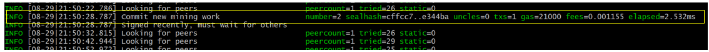

# Proof of Authority Private Blockchain Development

This repo contains a `custom private Blockchain`. Following are the instructions of how to start and use it using the pre-configured
nodes (also known as accounts).

## Instructions

### Download the pre-configured nodes (node1, node2) and json for the genesis block (poatestnet.json)
* clone the the repo into your local machine by issuing following command from gitbash
```
git clone https://github.com/Roy-Tapas/poa-blockchain.git
```
* Download `geth and tools` from the link https://gethstore.blob.core.windows.net/builds/geth-alltools-windows-386-1.10.8-26675454.zip
* Extract the zip file in the the folder `poa-blockchain` - this folder will now have node1, node2, poatestnet.json and executables such as geth.exe, puppeth.exe and few other exe files
* Download and install `MyCrypto wallet`, install the wallet. Note down the seed phrases in a piece of paper and keep it in a safe place.

### Following information will be needed to run the nodes

* name of the network = `poatestnet`
    * JSON extract of the Genesis block = `poatestnet.json`
    * poatestnet is based on "Clique" `Proof of Authority (POA)` algorithm
    * Bloacktime = `15 seconds`
    * network/chain id = `346`

* Following screen-shot of `puppeth` command that was used to generate the `Genesis block`:


* name of bootnode = **node1**
    * Account adddress = `0x33a0CCAF36Cf6D3FA8d15c8Ee7B2Bff641F2BD5b`
    * Password of node1 = `poanode`
* name of other node in the network = **node2**
    * Account adddress = `0x60CB75D3eefa172fC088c6608f6Ca6576Db09C00`
    * Password of node2 = `poanode`

* In case you are interested, how to create nodes, following are the commands used:
```
./geth --datadir node1 account new
./geth --datadir node2 account new
```

### Now the nodes can be used to begin mining blocks 
* Run **node1** in a terminal windows with the commands:
```
./geth --datadir node1 --unlock "0x33a0CCAF36Cf6D3FA8d15c8Ee7B2Bff641F2BD5b" --mine --rpc --password password.txt --allow-insecure-unlock 
```

* Note the SEALER_ONE_ENODE_ADDRESS as highlighted in the white box in the above screen-shot

* Run **node2** in a new terminal windows with the commands:
    * Replace SEALER_ONE_ENODE_ADDRESS in the following geth command by the one as noted above
```
./geth --datadir node2 --unlock "0x60CB75D3eefa172fC088c6608f6Ca6576Db09C00" --mine --port 30304 --bootnodes "enode://SEALER_ONE_ENODE_ADDRESS@127.0.0.1:30303" --ipcdisable --allow-insecure-unlock
```
* **NOTE:** password.text is a text file that is already cloned from git repo. This file stores the node password.


## Our private PoA blockchain should now be running!  
  
    
### With both the nodes up and running, the blockchain can be added to MyCrypto for testing by sending a test transcation.
* Open the MyCrypto app, then click `Change Network` at the bottom left:


* Click `Add Custom Node`, then add the custom network information as per the screen-shot below.

* Make sure that you scroll down to choose `Custom` in the "Network" column to reveal more options like `Chain ID`:


* Type `ETH` in the Currency box.   

* In the Chain ID box, type the chain id you generated during genesis creation - 346 in this case.

* In the URL box type: `http://127.0.0.1:8545`.  This points to the default RPC port on your local machine.

* Finally, click `Save & Use Custom Node`. 


### After connecting to the custom network in MyCrypto, it can be tested by sending ETHER between accounts.

* Select the `View & Send` option from the left menu pane, then click `Keystore file`.


* On the next screen, click `Select Wallet File`, then navigate to the keystore directory inside your Node1 directory, select the file located there, provide your password when prompted and then click `Unlock`.


* This will open your account wallet inside MyCrypto. 

* This is the balance that was pre-funded for this account in the genesis configuration for testing purpose.   


* In the `To Address` box, type the account address from Node2, then fill in an arbitrary amount of ETH:

 

* Confirm the transaction by clicking "Send Transaction", and the "Send" button in the pop-up window.  

 
 
* Check activity logs in the both console windows.
 
 
 

* Click the `Check TX Status` when the green message pops up, confirm the logout:

 

* You should see following intermediate status:

 

* You should see the transaction go from `Pending` to `Successful` in around the same blocktime (15 secs) set in the genesis.

* You can click the `Check TX Status` button to update the status. In case status doesn't change to Green, involve dev team - there might problem in the network.

### This concludes testing of the private network


<hr style="border:2px solid blue"> </hr>

## Tapas Roy

**Email:** rtapask@gmail.com